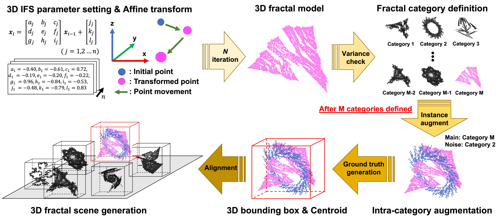

# Point Cloud Fractal DataBase (PC-FractalDB) CVPR 2022

## Abstruct
The construction of 3D point cloud datasets requires a great deal of human effort. Therefore, constructing a large-scale 3D point clouds dataset is difficult. 
In order to remedy this issue, we propose a newly developed point cloud fractal database (PC-FractalDB), which is a novel family of formula-driven supervised learning inspired by fractal geometry encountered in natural 3D structures.
Our research is based on the hypothesis that we could learn representations from more real-world 3D patterns than conventional 3D datasets by learning fractal geometry. 
We show how the PC-FractalDB facilitates solving several recent dataset-related problems in 3D scene understanding, such as 3D model collection and labor-intensive annotation. 
The experimental section shows how we achieved the performance rate of up to 61.9% and 59.4% for the ScanNetV2 and SUN RGB-D datasets, respectively, over the current highest scores obtained with the PointContrast,  contrastive scene contexts (CSC), and RandomRooms. 
Moreover, the PC-FractalDB pre-trained model is especially effective in training with limited data. For example, in 10% of training data on ScanNetV2, the PC-FractalDB pre-trained VoteNet performs at 38.3%, which is +14.8\% higher accuracy than CSC. Of particular note, we found that the proposed method achieves the highest results for 3D object detection pre-training in limited point cloud data. 



## Requirements

* Python 3.x (worked at 3.7)

* open3D (worked at 0.13.0)

* numpy (worked at 1.19.0)

* jsons

## Running the code

We prepared execution file PCFractalDB_render.sh in the top directory. The execution file contains our recommended parameters. Please type the following commands on your environment. You can execute the Fractal Category Search, FractalNoiseMix, 3D Fractal Scene Generate, PC-FractalDB Construction.

```bash PCFractalDB_render.sh```

The folder structure is constructed as follows.

```misc
./
  PC-FractalDB/
    3DIFS_param/
      000000.csv
      000001.csv
      ...
    3Dfractalmodel/
      000000/
        000000_0000.ply
        000000_0001.ply
        ...
      ...
    3Dfractalscene/
      scene_00000.json
      scene_00001.json
      ...
    ...
  render.sh
```

## Pre-train / Fine-tune in 3D object detection
 We employed spatiotemporal Convolutional Neural Networks. We mainly used ```PointContrast``` and ```VoteNet``` for main experiments and ```ContrastiveSceneContexts``` for additional experiments.

* [PointContrast](https://github.com/facebookresearch/PointContrast)
* [VoteNet](https://github.com/facebookresearch/votenet)
* [ContrastiveSceneContexts](https://github.com/facebookresearch/ContrastiveSceneContexts)
